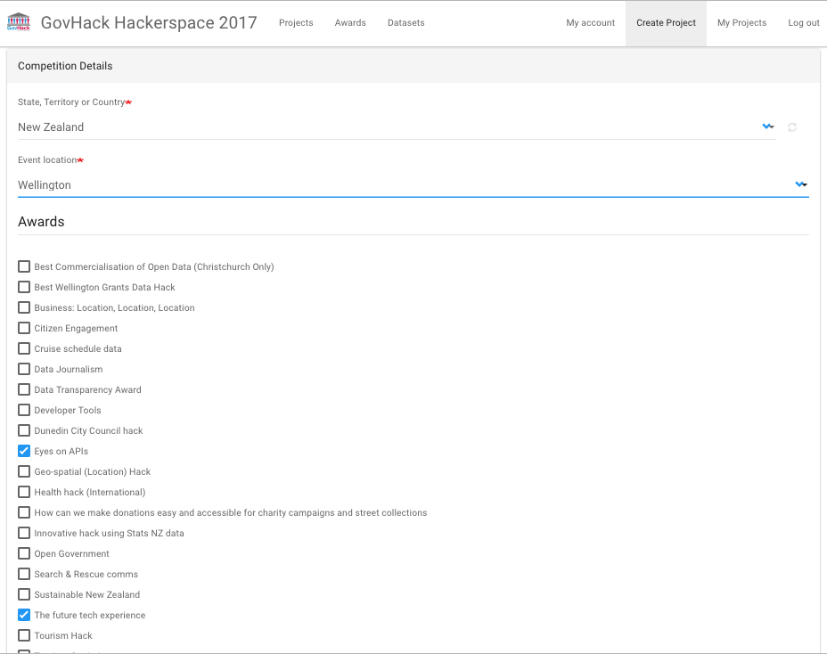

# Data.govt.nz Govhack
All the bounties and prizes are listed at:

[https://docs.google.com/spreadsheets/d/1LxOXA7jNm7JWp0oJ5C6NsviPuEaPqJrsV-zznaI2dFY/edit?usp=sharing](https://docs.google.com/spreadsheets/d/1LxOXA7jNm7JWp0oJ5C6NsviPuEaPqJrsV-zznaI2dFY/edit?usp=sharing)

Here's the sepcific bounties offered by data.govt.nz and the Department of Internal Affairs this year (2017).

You can select these when you register your project in the [GovHack Hackerspace](https://2017.hackerspace.govhack.org)

## "Eyes on APIs"	

What does a digital service from government look like when powered by APIs and open data? 

Reimagine a citizen's interaction with government that might require a cross-agency approach and connect the dots through APIs (or propose what these APIs might need to look like! What transactions might need to be available and where?).

For example, registering a birth, applying for the childs IRD number and getting them a passport at the same time!

### Criteria for entry 
Use at least one data API from data.govt.nz to rethink a government online service for citizens.

You might like to make use of the experimental government services register at [https://catalogue.data.govt.nz/dataset/lab-experimental-government-service-registers](https://catalogue.data.govt.nz/dataset/lab-experimental-government-service-registers)

## "The future tech experience"

How does interaction with government change in the future with the rise of technologies like voice search/natural language processing, artificial intelligence, chatbots, Virtual and Augmented Reality? 

Reimagine an interaction with government that makes use of one of these emerging technologies and demonstrate the changes government might need to make to move towards this future.

### Criteria for entry
Demonstrate a common citizen interaction with government like getting a passport/finding out your cizitenship status using an emerging technology such as voice search, automated chatbots, AI, VR or AR (or a combination of!).

